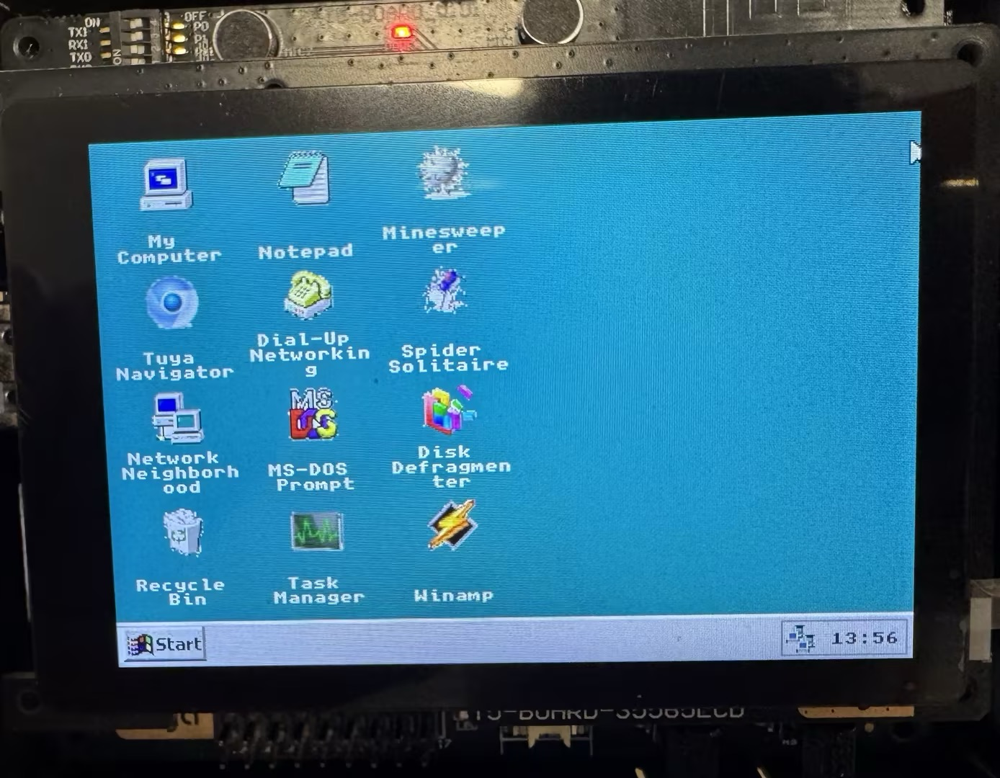
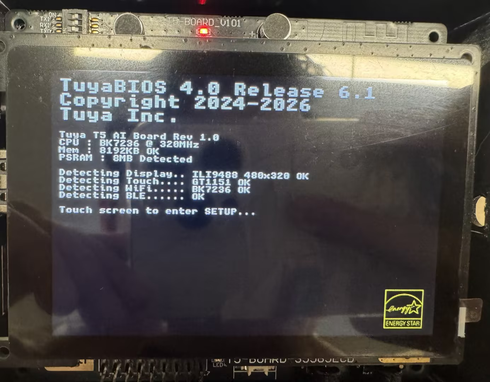
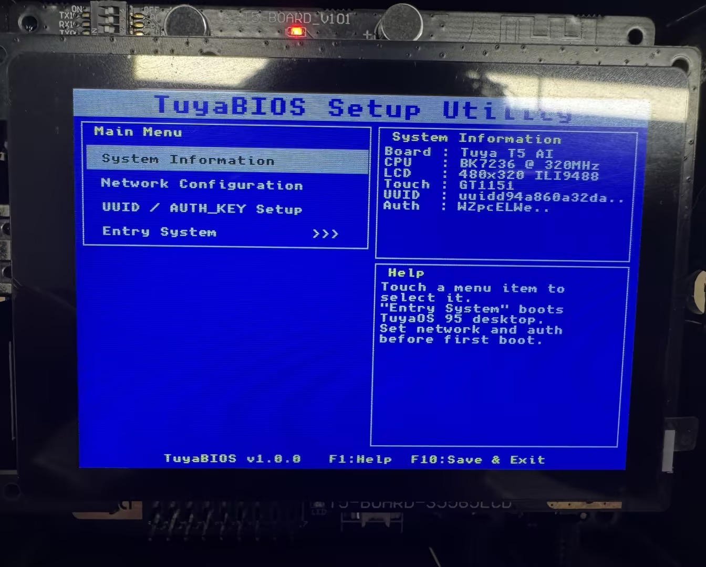
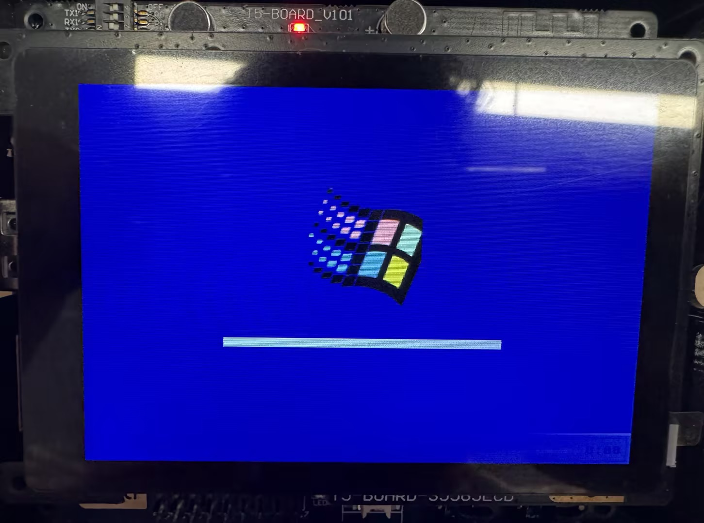
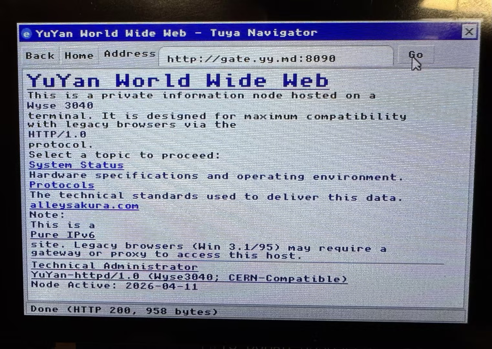
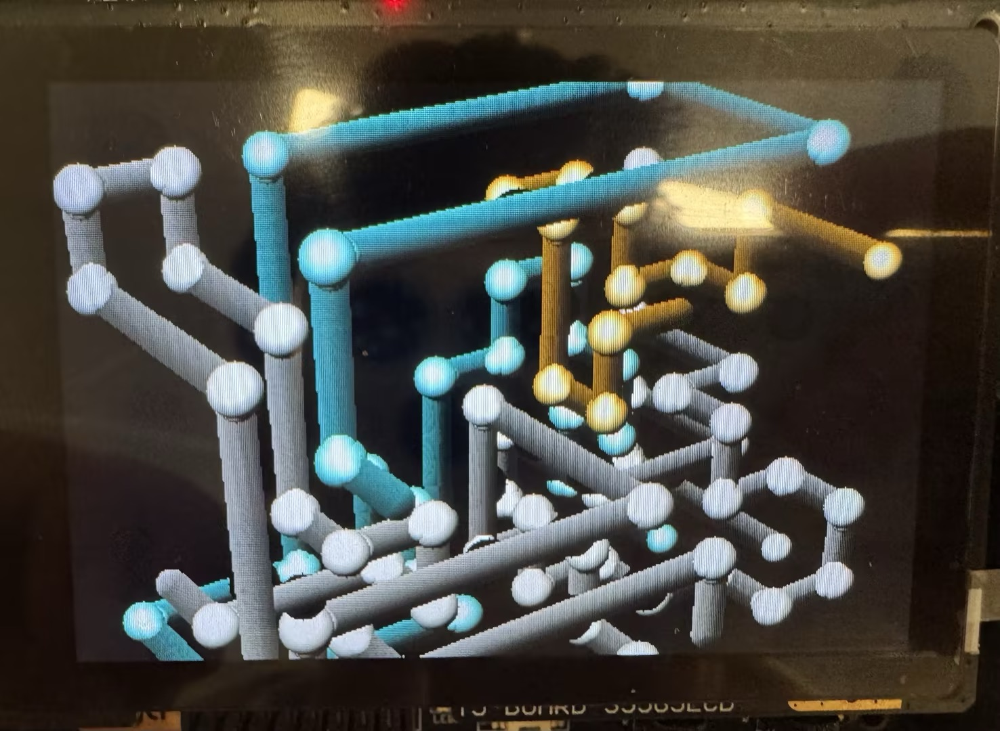
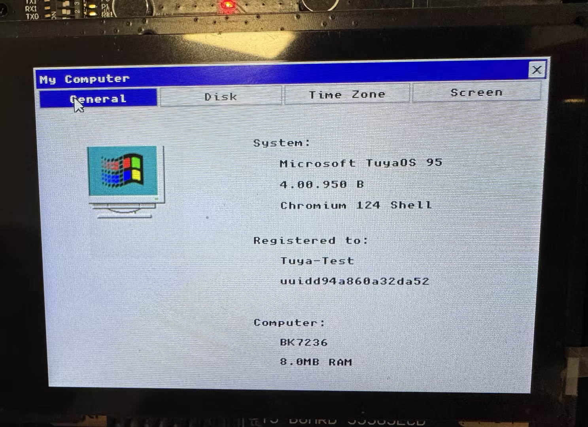

  <h1>Tuya95</h1>
  
Windows 95 inspired embedded desktop for TuyaOpen on the T5 AI development board.

  
<a href="./README_zh.md">简体中文</a>

  

## Overview

| Item | Details |
| --- | --- |
| Platform | TuyaOpen `T5AI` |
| Display | 480×320 landscape desktop UI |
| UI stack | LVGL v9 with custom Win95 styling |
| Input | Touch, on-screen keyboard, USB HID keyboard and mouse |
| Theme | Windows 95 style boot flow, desktop, dialogs, icons, taskbar and screensaver |
| Focus | Nostalgic Win95 UX adapted to an embedded TuyaOpen board |

## Screenshot Gallery

| Before BIOS | BIOS Setup | Win95 Boot |
| --- | --- | --- |
|  |  |  |

| Desktop | Browser | 3D Pipes Screensaver | About / System |
| --- | --- | --- | --- |
|  |  |  |  |

## Feature Matrix

| Area | Module | What it does |
| --- | --- | --- |
| Boot flow | Pre-BIOS screen | Simulates the black pre-BIOS stage with Energy Star branding before firmware UI appears. |
| Boot flow | BIOS setup utility | Provides a retro setup screen for network and authorization related configuration flow. |
| Boot flow | Win95 boot splash | Shows a Windows 95 style startup screen before entering the desktop shell. |
| Shell | Desktop | Full-screen Win95 desktop with pixel-style icons, classic teal wallpaper, taskbar, tray clock and Start menu. |
| Shell | Start menu | Includes Navigator, Notepad, MS-DOS, My Computer, Dial-Up, About, BIOS Setup and Shut Down entries. |
| Shell | Cursor policy | Hides the mouse during early boot and screensaver states, then restores it for desktop interaction. |
| System | My Computer | Multi-tab system window with `General`, `Disk`, `Time Zone` and `Screen` pages. |
| System | General tab | Mimics Win95 System Properties with machine summary, branding and board information. |
| System | Disk tab | Browses `/sdcard`, shows mount state, capacity hints and basic file operations for the TF card. |
| System | Time Zone tab | Lets the user choose and apply a timezone used by the desktop clock and DOS time output. |
| System | Screen tab | Hosts the Win95 style `3D Pipes` screensaver settings and full-screen preview entry point. |
| Screensaver | 3D Pipes | Full-screen animated pipes renderer tuned for the classic Win95 OpenGL screensaver feel. |
| Networking | Dial-Up Networking | Provides Wi-Fi direct connect and a Tuya pairing page for PID, UUID and AuthKey setup. |
| Networking | Network Neighborhood | Scans nearby Wi-Fi APs and performs a simple LAN TCP port 80 sweep. |
| Networking | Tray indicator | Shows a Win95 style network tray icon when Wi-Fi is connected. |
| Time | NTP sync | Syncs time after network connection and updates the tray clock accordingly. |
| Browser | Tuya Navigator | Embedded retro browser with address bar, history-style navigation and Win95 window chrome. |
| Browser | HTTP stack | Uses a raw-socket HTTP/1.0 client plus a TLS wrapper for HTTPS-capable browsing. |
| Browser | HTML renderer | Supports a compact subset of HTML suitable for simple and early web pages. |
| Browser | JavaScript subset | Includes a tiny interpreter with arithmetic, functions, loops, `document.write`, `alert`, `Math`, string ops and basic DOM-style hooks. |
| Productivity | Notepad | Full-screen text editor with local KV persistence, save/new/delete actions and Recycle Bin integration. |
| Productivity | MS-DOS Prompt | Retro terminal with commands such as `HELP`, `VER`, `CLS`, `DIR`, `ECHO`, `DATE`, `TIME`, `SET`, `MEM`, `IPCONFIG`, `CD`, `PING` and `EXIT`. |
| Productivity | Soft keyboard | Win95 style on-screen keyboard for text fields, including MS-DOS, browser and config forms. |
| Utilities | Task Manager | Displays task list, CPU usage, memory usage, handles and thread counters. |
| Utilities | Disk Defragmenter | Animated Win95 style defrag simulation with progress feedback. |
| Utilities | Recycle Bin | Stores deleted content and supports restore or empty actions. |
| Media | Winamp | Plays `16 kHz / 16-bit / mono` WAV files from `/sdcard/music` with a Winamp-inspired interface. |
| Games | Minesweeper | Playable Win95 style `9×9` minesweeper with timer and mine counter. |
| Games | Spider Solitaire | Single-suit Spider Solitaire with stock dealing, score tracking and completion detection. |
| Platform | USB HID | Supports external USB keyboard and mouse through the platform USB host layer. |
| Platform | Storage | Mounts the TF card on `/sdcard` after desktop boot to avoid early boot pin conflicts. |

## Controls

| Input | Behavior |
| --- | --- |
| Touch | Open icons, press Start, switch tabs, click buttons and interact with games/windows. |
| On-screen keyboard | Appears for editable fields such as MS-DOS, browser address bar and config dialogs. |
| USB keyboard / mouse | Works through the HID host integration once the desktop is initialized. |
| Screensaver preview | Launch from `My Computer > Screen > Preview`; tap to exit the full-screen saver. |

## Build

| Step | Command |
| 1 | `tos.py build` |

## Project Layout

| Path | Purpose |
| --- | --- |
| `src/bios_ui.c` | Pre-BIOS and BIOS setup screens |
| `src/win95_desktop.c` | Desktop shell, taskbar, Start menu and boot splash |
| `src/win95_mypc.c` | My Computer / System Properties window |
| `src/win95_pipes.c` | 3D Pipes screensaver renderer and full-screen preview |
| `src/win95_ie.c` | Tuya Navigator browser UI |
| `src/win95_html.c` | Minimal HTML renderer |
| `src/win95_js.c` | Minimal JavaScript interpreter |
| `src/win95_dialup.c` | Wi-Fi connect and Tuya pairing pages |
| `src/win95_dos.c` | MS-DOS Prompt emulator |
| `src/win95_notepad.c` | Notepad editor |
| `src/win95_net.c` | Network Neighborhood |
| `src/win95_taskmgr.c` | Task Manager |
| `src/win95_mine.c` | Minesweeper |
| `src/win95_spider.c` | Spider Solitaire |
| `src/win95_winamp.c` | Winamp-style WAV player |
| `src/win95_logos.c` | Pixel-art logos and icon assets |

## Notes

| Topic | Details |
| --- | --- |
| Resolution | The UI is tuned for a 480×320 landscape panel. |
| Storage | Audio and file browsing expect a mounted TF card at `/sdcard`. |
| Network | Best results come after Wi-Fi connection so clock sync, browser and pairing features can be exercised. |
| Visual goal | The project targets Win95 flavor first, not a modern flat reinterpretation. |

